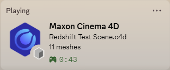

## What It Looks Like

## Installation Instructions
There may be an easier way to install; I don't use Cinema 4D so I'm not familiar with plugin installation. This method works.
- Download the Cinema 4D ZIP from releases, or clone the repository and copy the c4d_presence folder
- Unzip/copy the contents somewhere that the files can stay (e.g., make a new C4DPlugins folder and place c4d_presence under it)
- Open Cinema 4D and go to Edit -> Preferences -> Plugins
- Add the folder location to Search Paths
- Restart Cinema 4D

## Accessing Settings
Under Edit -> Preferences there will be a new C4DPresence tab.

## Settings & Features
#### State and Details allow you to choose from:
- **Document**: name of the active document
- **Object**: name of the active object
- **Mesh count**: number of mesh objects in the document
- **Generator count**: number of mograph generators in the document
- **Effector count**: number of mograph effectors in the document
- **Light count**: number of lights in the document
- **Camera count**: number of cameras in the document
- **Material count**: number of materials in the document
- **Texture count**: number of textures in the document
- **Current frame**: the current frame of the document

#### Rendering
When rendering, if render details are enabled, render information will override the details field with information about the render: the scene name and resolution, formatted as "Rendering {scene name}: {width}x{height}". I am not aware of any straightforward method to monitor the render progress in Cinema 4D, so the frame range and current frame are not included.

Additionally, if render details and small icons are enabled and the render engine is a supported extension (Arnold, Redshift, V-Ray, Octane), the render engine will be displayed as the small icon.

#### Icons
If you enable small icons, besides the rendering icons, there are 12 icons for document modes you may be in (animation, camera, edges, ik, model, object, paint, points, polygons, texture, uv, and workplane).