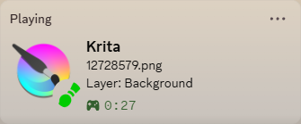

## What It Looks Like

## Installation Instructions
#### ZIP Install (easiest):
- Download krita_presence.zip from the releases
- Open Krita and go to Tools -> Scripts -> Import Python Plugin; select the downloaded ZIP file
- Restart Krita
- Go to Configure Krita -> Python Plugins Manager and enable the plugin
#### Manual Install:
- Open Krita and go to Settings -> Manage Resources -> Open Resource Folder
- Drag and drop the contents of the root krita_presence folder (the folder containing krita_presence.desktop) into the pykrita folder
- Restart Krita
- Go to Configure Krita -> Python Plugins Manager and enable the plugin

## Accessing Settings
Go to Tools -> Scripts and click 'KritaPresence Settings' to open the GUI settings menu.

## Settings & Features
#### State and Details allow you to choose from:
- **Active document name**: your file name (e.g., *'Document.kra'*). Defaults to *'Unsaved document'* on new documents.
- **Number of documents**: the number of documents currently opened, formatted as *'__ document[s] active'*
- **Active layer**: the name of the active layer, and sublayer count if nonzero. If the layer name contains 'Layer', e.g., *'Layer 2'*, just the name will appear; if it does not, e.g., *'Shadows'*, it will be prefixed by 'Layer: ', e.g., *'Layer: Shadows'*. The sublayer count, if nonzero, is appended in parentheses; e.g., *'Layer: Shadows (3 sublayers)'*.
- **Layers in active document**: the number of layers in the current document, formatted as *'__ layer[s]'*
- **Tool info**: the name of the current tool, and its blend mode if not 'normal', e.g., *'Freehand Brush Tool (Dodge)'*
- **Brush preset**: the name of the active brush preset; appears only when a brush-like tool is active (freehand brush, dynamic brush, multibrush). If the name has a letter-parentheses prefix like most of the default brushes do (e.g., 'b) Basic-5 Size default'), the prefix is removed. If it has '(mypaint)' or '(mypaint)_prev' in the name, that is also removed. Lastly, it is formatted as *'Preset: __'*. For example, if 'c) Pencil 1 Sketch (mypaint)' is the brush, the status will read *'Preset: Pencil 1 Sketch'*
- **Color profile**: The color model and profile of the document, with the profile following the model in parentheses, e.g., *'Color Model: RGBA (sRTB-elle-V2-g10.icc)'*
- **Document dimensions**: the dimensions and DPI of the document, formatted as *'WxH @ _dpi'*, e.g., *'2000x2000 @ 300dpi'*
- **Layer blend mode**: the blend mode of the active layer, e.g., Darken, formatted as *'Layer Blend Mode: _'*, ***if and only if*** the blend mode is not *'normal'*, in which case cycling state or details will skip this; if you select it manually, nothing will be displayed.
- **Total time on document**: *approximate* total time spent on document in hours and minutes. If no keyboard, mouse, or tablet inputs are made for more than 3 minutes, time will stop incrementing and *'(Idle)'* will be added to the status. For example: *'Document time: 3h 17m'*, when idle, becomes *'Document time: 3h 17m (Idle)'*.

#### Icons
If you enable small icons, the icon for the tool you are currently using will be displayed as a small icon.
If you additionally enable colored icons, whenever you have the regular paint brush selected, the small icon displayed on discord will be a colored version of the paint brush icon. Since the icon must be chosen from a set of <300 pre-uploaded icons, the color will not exactly match the color in Krita; however, 250 icons were selected from perceptual color space and the result is likely to be quite close. 

Enabling colored icons will also create a tooltip on the icon with a name for the color among the 250 colors which was closest to your Krita color, as well as the hex code of the actual Krita color, e.g., 'Painting in Imperial Purple (#602F6B)'. The default is to use creative color names, but if you want something more plain, you can turn off the 'evocative names' setting to use ISCC-NBS color names, which are a standardized set of more straighforward names such as 'Moderate Purple'.