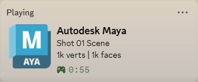

## What It Looks Like

## Installation Instructions
- Download and extract the MayaPresence ZIP from releases or clone the repository, run the build script, and copy the maya_presence folder from dist/. Place the contents (maya_presence.mod and the maya_presence folder) somewhere in your MAYA_MODULE_PATH (see https://help.autodesk.com/view/MAYAUL/2027/ENU/?guid=GUID-228CCA33-4AFE-4380-8C3D-18D23F7EAC72); on Windows the best default location is likely Documents/maya/modules. If the modules folder does not exist, you can create it. Make sure the maya_presence.mod file is at the top level in this location; e.g., if you choose Documents/maya/modules, then Documents/maya/modules should contain maya_presence.mod and maya_presence/, and not a folder which has the .mod and maya_presence/ folders within it, otherwise the plugin will not be detected by Maya.
- Restart Maya if it was already running
- Open Maya and go to Windows -> Settings/Preferences -> Plug-In Manager. There should be a new tab "...Documents/maya/modules/maya_presence"; check the "Loaded" and "Auto load" boxes to enable the plugin in the current session and on startup. (You will need to restart Maya for the settings menu to work, but RPC updates should work immediately.)

## Accessing Settings
Under "Windows" in the top toolbar, a new option will be added at the bottom of the menu: "Maya Presence Settings...". Click to open the GUI settings menu.

## Settings & Features
#### State and Details allow you to choose from:
- **Scene name**: The names of the current project and scene, separated with a "|", e.g., "Current Project | Current Scene.mb".
- **Mesh count**: the number of meshes in the scene
- **Poly count**: the number of faces and verts in the scene. If you have the HUD element for polygon information enabled, these counts will include viewport smoothing; if not, they will be unsmoothed values.
- **Joint count**: the number of joints in the scene.
- **Light count**: the number of lights in the scene.
- **Camera count**: the number of camera objects in the scene, excluding the default perspective and orthographic cameras.
- **Blendshape count**: the number of blendshapes in the scene.
- **Material count**: the number of materials in the scene.
- **Texture count**: the number of textures in the scene.
- **File size**: the size of the scene file on disk.
- **Current frame**: the currently selected frame.
- **Active object**: the object currently selected
- **Current tool context**: the context name of the current tool, e.g., "PolyCut"

#### Render Engine Plugins
- For light, material, and texture count, third-party render engines add custom types which will not be picked up by a simple search for objects of the default 'light' type category in Maya. A global setting exists for each engine to decide whether to count its resources in each of those categories, along with default Maya resources. This may increase the time required for an RPC update since it runs a more complex search through the scene graph.

#### Rendering
When rendering, if render details are enabled, render information will override the details field with information about the render: the scene name, resolution, and frames rendered, formatted as "Rendering {scene name}: {width}x{height}, Frame {frame}"
Additionally, if render details and small icons are enabled and the render engine is a supported extension (Arnold, Redshift, V-Ray, RenderMan), the render engine will be displayed as the small icon.

#### Icons
If you enable small icons, besides the rendering icons, there are icons for the workspace or context you are in. 
The first check will be workspace: if you are in the Modeling workspace you will get a modeling icon, Animation will get an animation icon, etc.
If you are in the 'General' workspace, the current tool context will be evaluated. For a subset of the contexts, an icon has been selected; others (e.g., selection) are not specific to a particular task and will not get an icon.